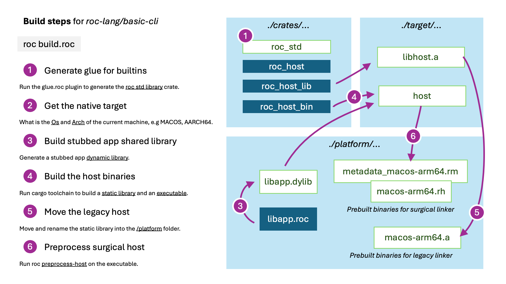

# basic-cli

A Roc [platform](https://github.com/roc-lang/roc/wiki/Roc-concepts-explained#platform) to work with files, commands, HTTP, TCP, command line arguments,...

:eyes: **examples**:
  - [0.10.x](https://github.com/roc-lang/basic-cli/tree/0.10.0/examples)
  - [0.9.x](https://github.com/roc-lang/basic-cli/tree/0.9.1/examples)
  - [0.8.x](https://github.com/roc-lang/basic-cli/tree/0.8.1/examples)
  - [latest main branch](https://github.com/roc-lang/basic-cli/tree/main/examples)

:book: **documentation**:
  - [0.10.x](https://www.roc-lang.org/packages/basic-cli/0.10.0)
  - [0.9.x](https://www.roc-lang.org/packages/basic-cli/0.9.1)
  - [0.8.x](https://www.roc-lang.org/packages/basic-cli/0.8.1)
  - [latest main branch](https://www.roc-lang.org/packages/basic-cli)

## Building the platform

The following diagram shows the steps for `roc build.roc` which build the platform binaries.



## Running an example locally

After building the platform, you will now have the prebuilt binaries in the `/platform` directory.

You can now run an example like;

```sh
$ roc examples/hello-world.roc
Hello, World!
```
